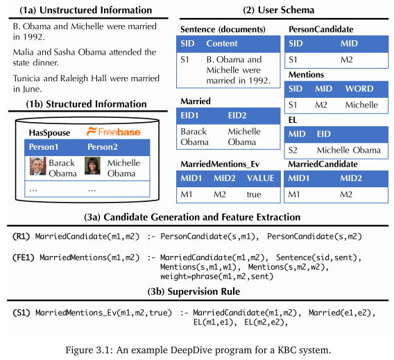

## 0 简介

deepdive是一个具有语言识别能力的信息抽取工具，可用作KBC系统（Knowledge Base Construction）的内核。
也可以理解为是一种Automatic KBC工具。
由于基于语法分析器构建，所以deepdive可通过各类文本规则实现实体间关系的抽取。
deepdive面向异构、海量数据，所以其中涉及一些增量处理的机制。
PaleoDeepdive是基于deepdive的一个例子，用于推测人、地点、组织之间的关系。

deepdive的执行过程可以分为：
- feature extraction
- probabilistic knowledge engineering
- statistical inference and learning

系统结构图如下所示：


KBC系统中的四个主要概念：
- Entity
- Relationship
- Mention，一段话中提及到某个实体或者关系了
- Relation Mention

Deepdive的工作机制分为特征抽取、领域知识集成、监督学习、推理四步。
闲话，Deepdive的作者之一Christopher Re之后创建了一个数据抽取公司Lattice.io，该公司在2017年3月份左右被苹果公司收购，用于改善Siri。

## 1 安装
### 1.1 非官方中文版cn_deepdive
项目与文档地址：
- [cn-deepdive](http://openkg.cn/tool/cn-deepdive)
- [DeepDive_Chinese](https://github.com/qiangsiwei/DeepDive_Chinese)

使用了中文版本cndeepdive，来自openkg.cn。但这个版本已经老化，安装过程中有很多坑。
- moreutils无法安装问题。0.58版本失效，直接在deepdive/extern/bundled文件夹下的bundle.conf中禁用了moreutils工具，并在extern/.build中清理了对应的临时文件，之后使用了apt进行了安装。
- inference/dimmwitterd.sh中17行对g++版本检测的sed出现了问题，需要按照github上新版修改。
- `numa.h: No such file or directory`，直接安装libnuma-dev

### 1.2 官方版本
按照[官方教程](http://deepdive.stanford.edu/quickstart)进行配置：
```
ln -s articles-1000.tsv.bz2 input/articles.tsv.bz2
```

在input目录下有大量可用语料。
```sql
deepdive do articles
deepdive query '?- articles("5beb863f-26b1-4c2f-ba64-0c3e93e72162", content).' \
    format=csv | grep -v '^
```

使用Stanford CoreNLP对句子进行标注。包含NER、POS等操作。查询特定文档的分析结果：
```sql
deepdive do sentences
deepdive query '?- 
    sentences("5beb863f-26b1-4c2f-ba64-0c3e93e72162", _, _, 
    tokens, _, _, ner_tags, _, _, _).' 
    format=csv | grep PERSON | tail
```

查看相关的命名实体对：
```sql
deepdive do spouse_candidate
deepdive query 'name1, name2 ?-  
    spouse_candidate(p1, name1, p2, name2),  
    person_mention(p1, _, "5beb863f-26b1-4c2f-ba64-0c3e93e72162", _, _, _).'
```

运行查询：
```sql
deepdive do probabilities
deepdive sql "
    SELECT p1.mention_text, p2.mention_text, expectation
    FROM has_spouse_label_inference i, person_mention p1, person_mention p2
    WHERE p1_id LIKE '5beb863f-26b1-4c2f-ba64-0c3e93e72162%'
      AND p1_id = p1.mention_id AND p2_id = p2.mention_id"
```

可视化展示：
```sql
mindbender search update
mindbender search gui
```

## 2 工作机理


数据将首先进行实体识别，之后进行实体连接，最后输出满足用户指定关系的集合。例如，官方的has_couple这个例子中，输入是一个文档集合和一个小的人工标注的实例集合。系统输出是属于couple的list of pairs。
Deepdive包含以下关键执行步骤：

### 2.1 特征抽取机制

特征抽取是deepdive实现知识抽取的第一步。deepdive会使用Stanford NLPCore工具将所有的原始数据进行清洗，并每句一行存储于数据库中。这些原始特征内容包括：HTML标记、POS标签、语言标记。deepdive支持人工从原始数据中指定特定的pattern作为特征（所以需要专家撰写特征提取脚本，符合deepdive特征接口）。


这些特征包括：

- 将某两个词在标签中是否是同一行作为特征
- 语序结构上的特征

这些特征将用作之后自动推理的“证据”，用于推断不同实体之间的关系。

### 2.2 领域知识集成
deepdive支持已知“事实”的输入，这些事实（专家知识）将在之后推理过程中对推理结果进行约束，可以改善结果。这些专家知识不是必须的。

### 2.3 监督学习
很难找到足够的训练样本（用于训练特征组合）。
deepdive里面有一种叫distant supervision的机制。
其主体思想是在现有文本资料中人工找到具有正例的样本，并通过相关的关系生成反例样本。

### 2.4 推理

使用了factor graph进行对特征、知识的推理。factor graph在表示中分为User Schema和Correlation Schema两部分，定义为`D=[R,F]`。以文本为例，factor graph将知识拆解为了随机变量和他们之间的关系。其中随机变量为不同位置的词语值，关系为词语位置、结构上的关系。Deepdive中的推理机制使用了Gibbs Sampling执行。

## 3 deepdive构成和程序使用



deepdive用户主要需要定义以下内容：
- 输入数据的样式，包括关系样式、中间数据格式与数据之间的映射关系。
- 用于进行distance supervise的规则。
- 推理参数。
- 原始数据处理方式。
- 特征提取方式。
其中前三项内容由每个deepdive应用中的app.ddlog文件定义，后两项一般使用udf中的python或shell脚本实现。

### 3.1 DDlog语言
DDlog是deepdive的专有语言，用于定义deepdive应用中的用户函数（UDF）和推理模型。
```lisp
Q(x, y) :- R(x, y), S(y).
Q(x, y) :- T(x, y).
```
关系推理，表示Q可以由R推导出来（relation Q are derived from relations R and S）。此外，规则部分情况下可以进行简化，例如以上规则可以化简为。
```lisp
Q(x, y) :- R(x, y), S(y); T(x, y).
```
此外[DDlog](http://deepdive.stanford.edu/writing-dataflow-ddlog)的文法支持常规逻辑运算和算术运算符，以及条件、表连接、聚合等SQL操作。

### 3.2 UDF用户自定义函数

UDF如果是python实现的话，将用annotation显示定义输入输出，同时需要在UDF中的添加对应的描述：
```lisp
function classify_articles over (id int, author text, words text[])
    returns (article_id int, topic text)
    implementation "udf/classify.py" handles tsj lines.
```
对应的python程序将如下所示：

```python
from deepdive import *  # Required for @tsj_extractor and @returns

compsci_authors = [...]
bio_authors     = [...]
bio_words       = [...]

@tsj_extractor
@returns(lambda article_id = "int", topic = "text",:[])
def classify(article_id = "int", author = "text", words = "text[]",):
    num_topics = 0
    if author in compsci_authors:
        num_topics += 1
        yield [article_id, "cs"]
    if author in bio_authors:
        num_topics += 1
        yield [article_id, "bio"]
    elif any (word for word in bio_words if word in words):
        num_topics += 1
        yield [article_id, "bio"]
    if num_topics == 0:
        yield [article_id, None]
```
